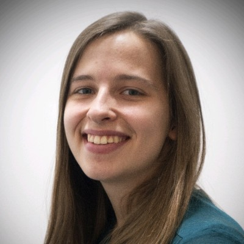
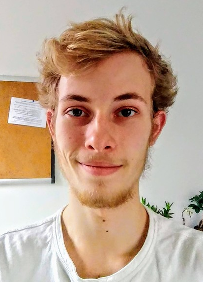

* * * 

## COMS30040
{: .lh-0 .fw-300 .text-center } 

# Types and Lambda Calculus
{: .text-center }

* * *
{: .mb-9 }

Welcome to the home of COMS30040: Types and Lambda Calculus.  This unit introduces you to type theory and the pure lambda calculus, which are two hugely influential parts of logic and the theory of programming languages.  

### Staff

The unit is run by Steven Ramsay (lectures), Samantha Frohlich (classes) and Eddie Jones (classes).

| Steven Ramsay | Samantha Frohlich | Eddie Jones |
|:-------------:|:-----------------:|:-----------:|
|{: width="130px" }|{: width="130px"}|{: width="100px"}|

### Technology

We will be using Microsoft Teams for all the interactive parts of the unit.  You should have already been invited/forcibly-added to the COMS30040 team.  Within the team you will find the following channels:

  * __General__: announcements appear here and all the unit teaching materials can be accessed from the tabs.
  * __Discussion Board__: post your questions here and we will try to answer them asap.
  * __QA Session__: the lecturer Q&A sessions are held here and, afterwards, the recordings will be linked from the channel conversation.
  * __Room E__: Eddie's classes are held here and your work will be returned to you through the Files tab.
  * __Room S__: Sam's classes are held here and your work will be returned to you through the Files tab.

You should receive calendar invites for the Q&A sessions and the classes closer to the time.  These invites will link you directly into Teams and so supercede the generic timetabling info that may currently occupy the same slots in your calendar.

### Workload

This is a 10 credit unit, and the unit runs during weeks 1--7.  You should expect to around 10 hours per week working on it.  There are 5 main activities:
* __Prerecorded lectures.__ At the start of each week, three prerecorded lectures will be posted on the unit website which you need to watch in your own time.
* __Problems.__ You will only learn on this unit by completing the problem sheets and exercises.  There is one sheet released each week and you are expected to work on it in your own time.
* __Online classes.__  Excepting week 1, every Tuesday there is a problem class in which our senior TAs, Eddie Jones and Samantha Frohlich, will guide you through the solutions and try to help with any questions you have.
* __Lecturer Q&A.__ Excepting week 1, every Monday at 3pm there will be a one-hour Q&A with the lecturer.  In week 1, this will start at 3:30pm due to Welcome Week events.  Apart from week 1, I recommend you attend the Q&A only if you wish to ask a question (it will be recorded so you will not miss out on an answer).
* __Reading/Revising.__  You will often benefit from alternative explanations of the same concepts, which would not fit into the time available for lectures.  You will need to spend time revising and rethinking topics before you can solve the associated problems.

*Each week, I recommend that you adopt the following pattern. Watch the first core lecture and the supplementary lecture.  Attend your problem class.  Then attempt this week's problem sheet and be sure to submit your solutions before Thursday 5pm. Finally watch the second core lecture.  If anything is unclear, come to the Q&A at the start of the following week and let's discuss it.*

### Assessment

This unit is assessed by a written exam, conducted online in the January assessment period.
